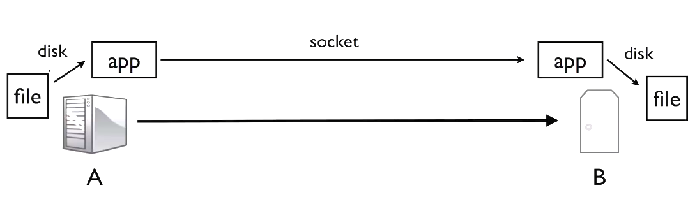
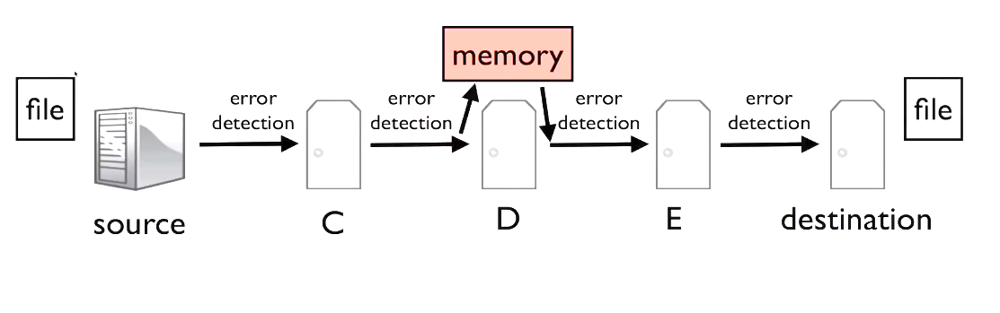

# End to End Princple

- first deals with correctness
  - if you don't follow the end-to-end principe when design your networked system, then chances it has a **flaw** and might **transfer data incorrectly**.

- second, call the "strong" end-to-end principle
  - is much broader and general.

## Application view of the world



- transfer a file from A to B
- application opens a connection between A and B
- A read a file and writes to the TCP connection
- B reads a data from the socket and writes the data to a file.


- **The network in this case does very little**
  - It just **frowards packets** from A to B
  - **set up A and B connection**

## Why Doesn't the Network Help?

- Compress data?
- Reformat/translate/improve requests?
- Serve cached data?
- Add security?
- Migrate connections across the network?
- Or one of any of a huge number of other things?

## The End-To-End Principle

```shell
The function in quesion can completely and correctly
be implemented only with the knowledge and help of
the application standing at the end points of the 
communication system. Therefore, providing that
questioned function as feature of the communcation
system itself is not possible. (Sometimes an incomplete
version of the function provided by the communication
system may be useful as performance enhancement.)
we call this of line of reasoning..."the end-to-end
argument."

                                    - Saltzer,Reed,and Clark,
                                    End-to-end Argumernts in System Design, 1984
```
-  providing that
questioned function as feature of the communcation
system itself is not possible
- an incomplete
version of the function provided by the communication
system may be useful as performance enhancement

Put another way, the netowrk cloud possibly do all kinds of things to help. 

If the system is going to work correctly, then the end points need to be responsible.Nobody else has the information necessary to do this correctly.

**The network can help you, but you can't depend on it.** For example, if you want to be sure your application is **secure**, you need to have **end-to-end security implemented the application.** The network night add additional security, but **end-to-end security can only be correctly done by the application itself.** So making secruity a feature of the network so that **application don't have to worry** about it is **not possible.**

## Example: File Transfer


- make sure the file arrives **completely** and **uncorrupted**.
- file data is **going to pass through several computers** between the source and the destination.
- **assumed:** 
   - > packet of data is corrupted in transmission, recipient can detect. Since it won't be corrupted on any link, it won't be corrupted. Therefore, if it arrives successfully at destination, there's no corruption, and the file has arrived successfully. 

   - **This assumption turned out to be wrong**

- **Why assumed wrong?**

    

   - let's say D had buggy **memory**, such that sometimes some bits would be **flipped**.
   - D received packets, checked, and found **correct**.
   - D move them to main memory, at which point they wolud become corrupted.
   - D forward packet, but because **error dection occurs on the link**, from the l**ink's perspective the packed looked fine** and it wolud **pass E check**.

> The link error dection was designed for errors in **transmission**, not errors in storage. 
> 
> The only way to be sure the file arrives correctly is to perform an **end-to-end check.**
>
> **The network can help, but it can't be reponsible for correctness.**

## Example: TCP


## Example: Link Reliability
- Today, wire link layers are highly reliable (unless your wire or connector is bad).
- But, wireless ones aren't, for a lot of reasons.
- It turns out that TCP doesn't work well when you have low reliability.
- wireless link layers improve thier repliability by **retransimission** at the **link layer.**
- For example, when your laptop sends a packet to an access point, if the access point receives the packet immediately -- just a few microseconds later -- sends a link layer acknowledgement to tell you laptop the packet was received successfully. If the laptop doesn't receive a link layer acknowlegment, it **retransmits.**
- Using these link layer acknowledgement can boost a poor link, with only 80% reliability, to 99% or higher.
- This lets TCP work much better.

## "Strong" End to End
```shell
The network's job is to transmit datagrams as
efficiently and flexibly as possible. Everything
else should be done at the fringes...
                                - [RFC 1985]
```

- This end-to-end principle is stronger than the first one.
  - The first one said that you have to implement sometime end-to-end, at the frings
  - but that you can also implement it int he middle for perfomance improvements.

- This principle says to NOT implement it in the middle. Only implement it at the fringes.
  - The resoning for the strong principle is **flexibility** and **simplicity**
  - if the network implement a piece of functionality to try to help endpoints, then it is assuming what the endpoints do.
  - For example, when a wireless link layer use retransmissions to improve reliability so TCP can work better, **it's assuming that the increased latency of the retransmissions is worth the reliability**. 
  - **This isn't always true**. There are protocols other than TCP, where **reliability isn't important**, **which might rather send a new, different, packet than retry sending an old one.**
  - But, because the **link layer has incorporated improved reliability**, these other protocols are **stuck** with it.  
  - As layers start to add optimizations assuming what the layers above and below them do, it becomes harder and harder to redesign the layers.
  - In the case of WiFi, it's a link layer that assumes certain behavior at the network and transport layers. If you invent a new transport or network layer, it's likely goint to assume how WiFi behaves so it can perform well.
  - In this way the network design becomes **calcified** and really hard to change.

In terms of long term design and network evolution, the strong end-to-end argument is tremendously valuable.

The tension is that in terms of short term desing and performance, network engineers and operators often don't follow it.

So over time the network performas better and better but becomes harder and harder to change.