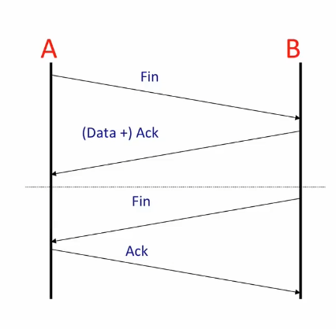
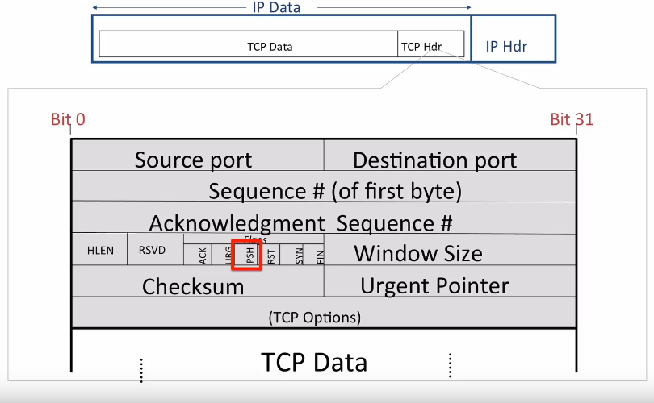

break data up into **discrete**, **self-contained** chunks of data

each chunk, called a **packet**

**packet** carries sufficient information

**network** can deliver the **packet** to destination.

**end-to-end argument** or **end-to-end principle**

set up **connection**

what do **TCP segments**

how can two computers **reliably transfer data with high performance**, 

**transfer data reliably**, **TCP** need to know when data has been corrupted， **detect errors in data using thress algorithm： checksums, cyclic redundancy checks, messages authentication codes**

basic tools and approach to **network protocol design**, **finite state machines**

through all of the details of the **state machine TCP** uses.

fully understand how **TCP transfers data reliab**

## TCP Service Model

- reliable

- end-to-end
- bi directional byte-stream service 

### Connection steup 3-way handshake

both ends of the **tcp connection**, keeps **a state machine to keep track of how the connection**

1. Syn (A -> B)
2. Syn + ACK (A <- B)
3. ACK (A -> B)

### TCP "stream of bytes" service

- hosts send data to each other as if it is from **a continuous stream of bytes**

  

- **either way, ** **TCP sees it as a stream of bytes**

### emulated using TCP "segments"

- stream of bytes is **delivered by TCP segments**

  

  

- tcp segement my need to be **transmitted multiple times**, such as **A doesn't receive an ACK**
- tcp segment can be **a small as 1-byte**, such as **ssh session**, each character is **sent one at a time**, rancher than **waiting for the whole**

- not very efficient when have **lots of data to send**, can **fill the TCP segment**,  **maximum IP datagram.**

### Connection teardown

- when A and B hava finished sending data to each other, need to close the connection
- close the connection and both ends can **clean up the state associated with the state machine**

- FIN
  - A close the connection by sending a FIN message, **which is short for finish.**
- (Data +) ACK
  - B acknowledges that **A no longer has data to send**.
  - B **stop looking for new data from A.**
  - this closes down the data stream from A to B.
  - but B might still have new data to send A.
  - B not ready to close down the channel from B to A.
  - the message from B to A carrying the **ACK can also carry new data from B to A.**
  - B **can keep sending new data to A as long as it needs to.**
  - B sometime later finishes sending data to A, and now sends its own FIN **to tell A can close the connection.**

- ACK
  - A replies by sending an ACK **to acknowlege that the connection is now closed.**
  - now, **both directions have finished,** the connection is **now fully closed** and **the state can removed.**

### TCP Service Model

1. **Stream of bytes:**,  TCP provides **a reliable stream of bytes between to application.**

2. **Reliable delivery**
   - make sure the data is **correctly delivered**.
   - TCP layer receives data, it **sends an acknowlegment back to sender** to let it **konw the data is arrived correctly.**
   - checksums detect corrupted data. 
     - TCP header carries a checksum covering the header and the data inside the segment
     - checksum to detect if the segment is corrupted along the way. 
     - for example: a bit-error on the wire or by a memory fault inside a router.
   - in the stream of bytes, **every segment header carries the sequence number **
     - first byte in the segment
     - for example, if the two sides agress that the 1000, then the **first segment have a sequence number of 1000**.
     - if the segment carries 500 bytes of data then the **next segment will carry the sequence number of 1500.**
     - if a **segment gets lost**, then the **sequence number will be incorrect** and the TCP layer **konw some data is missing.**
     - the sender will need to **resend the data.**
   - flow-control **prevents overrunning the receiver.**
     - if A faster than B, A to overwhelm B by sending data, B can't keep up.
     - receiver **keeps telling the sender if it can keep sending.**
     - receiver tell the sender **how much room it has in its buffers to accept new data.**
     - if B is falling behind, **the space drops possibly all the way to zero.**
     - when **it has more room**, **tells A and it can send more data.**

3. **In-sequence:** TCP delivers data to the application in the right sequence
   - whatever sequence the data was delivered from the application to TCP at A. some order in which it is sent from TCP to the application at B.
   - if **segments arrive out of order**, **the TCP layer use sequence number re-sequences them to the correct order.**

4. **Congestion Control:** divide up the **network capacity equally among all the TCP connections** using network.

### TCP Segment Format

- **Source Port and Destination Port**
  - Desitination port tell TCP  layer **which application the bytes should be delivered**
  - Source port tells TCP layer at the other end which port it should use **to send data back again.**
  - (a unique source port number, **differentinate the connection from any other connections.**)

- **Sequence # (of first byte)**
  - Sequence number in**dicates the position in the byte stream of the first byte in the TCP data field.**

- **Acknowlegment Sequence #**
  - Acknowlegment sequence number **tells the other end which byte we are expecting next.** 
  - (it also says that we have **successfully received every byte up util the one before this byte.**)
  - Notice that there are **sequence numbers of both directions in every segment.**
  - (This way, TCP **piggybacks acknowlegments** on the **data segment traveling in the other direction**.)

- **Checksum**
  - 16 bit checksum is **calculated over the entrie header and data.**
  - **helps the receiver detect corrupt data.**

- **Urgent Pointer**
  - tells us **how long the TCP header is.**

- **(TCP Options)**
  - optinal.
  - carry extra
  - added the TCP standard was creatd

- **Flags**
  - a bunch of flags used to signal information from one end of the connection to the other
  - **ACK** flag tells us that **the Acknowledgment sequence number is valid and we are acknowleding all of the data up util this point.**
  - **SYN** flag tells us that we are signalling a synchronize, (**3-way handshake to set up connection.**)
  - **FIN** flag signal the closing of **one direction of the connection.** (**one direction!!!**)
  - **PSH** flag tells the TCP layer at the other end to** deliver the data immediately upon arrival** (**rather than wait for more data!!!**)
  - (this is useful for **short segments carrying time critical data**, such as a key stroke. don't want the TCP layer to **wait to accumulate many keystrokes before delivering them** to the application.)

### TCP Unique ID of a TCP connection

- TCP connection is **uniquely identified by five pieces of information** in the **TCP and IP headers**.
